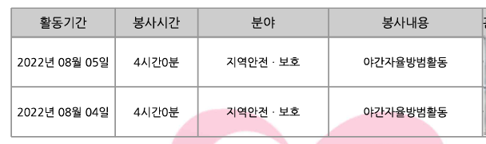

## 📅 **활동 기간**  
2022.08.04 ~ 2022.08.05 (총 8시간)

## 📜 **활동 인증**  
- **활동일:** 2022.08.04 ~ 2022.08.05  

---

## 📍 **참여 동기**  
지역 사회의 안전을 지키기 위해, 그리고 주민들의 불안감을 해소할 수 있는 활동에 참여하고 싶었습니다. 강릉시자원봉사센터에서 주관하는 야간자율방범활동은 지역 안전을 위해 중요한 역할을 하고 있다고 생각하여 참여하게 되었습니다.

---

## 🚶‍♂️ **활동 내용**  
2022년 8월 4일과 8월 5일, 강릉시자원봉사센터의 야간자율방범활동에 참여하여, 총 4시간 동안 지역 내 거리를 순찰하며 범죄 예방과 주민 안전을 위한 활동을 진행했습니다.

### 1. **순찰 활동**  
21:00부터 25:00까지, 주어진 구역을 돌아다니며 지역 내 이상 징후나 의심스러운 활동을 주의 깊게 살폈습니다. 순찰 중에는 주로 도로와 공원 주변을 점검하며, 의심스러운 상황을 발견할 경우 즉시 신고할 준비를 하였습니다.

### 2. **안전 확인 및 대응**  
주민들의 안전을 우선으로 생각하며, 상황에 따라 적극적으로 대처할 수 있도록 하였습니다. 주변을 살피고, 필요시 인근 경찰과 협조하여 더욱 효과적인 순찰을 진행할 수 있도록 했습니다.

---

## 😇 **좋았던 점**
1. **주민들과의 소통**  
   순찰 중 마주친 주민들과의 대화를 통해 지역 사회의 안전 문제에 대한 의견을 나눌 수 있었습니다. 특히, 주민들께서 순찰 활동에 감사의 말을 전해주셨을 때 보람을 느꼈습니다.

2. **안전한 환경 조성**  
   활동을 마친 후, 범죄 예방 활동이 실제로 지역 안전에 기여할 수 있다는 것을 실감할 수 있었습니다. 주변의 경각심을 일깨워줄 수 있었고, 주민들이 안심할 수 있는 환경을 만드는 데 도움을 준 느낌이었습니다.

3. **자원봉사의 중요성**  
   이 활동을 통해 자원봉사가 지역 사회에 실질적인 영향을 미칠 수 있음을 다시 한 번 느꼈습니다. 작은 노력들이 모여 큰 변화를 만들 수 있다는 점에서 자원봉사의 가치가 매우 중요하다는 것을 알게 되었습니다.

---

## ✍️ **마무리하며**  
강릉시자원봉사센터의 야간자율방범활동은 단순한 순찰 활동을 넘어서, 지역 사회의 안전을 직접 지키는 중요한 경험이었습니다. 주민들의 안전을 위해 적극적으로 참여하고, 또 다른 사람들과 협력하여 긍정적인 변화를 이끌어낼 수 있다는 점에서 큰 의미가 있었습니다.

앞으로도 이러한 활동에 지속적으로 참여하며 지역 사회에 기여하고, 안전한 환경을 만드는 데 도움을 주고 싶습니다. 😊
