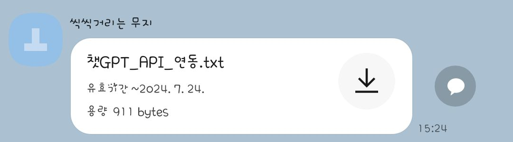

## 📅 **활동 기간**  
2023.06.20 ~ 2023.07.20 (한 달)

---

## 📍 **참여 동기**  
양양고등학교에서 재능 기부 활동을 통해 학교 홈페이지 개발을 지원하고, 학생들에게 실무적인 개발 경험을 전수하며 협업과 문제 해결 능력을 키우고자 했습니다. 체인지 메이커 동아리 친구들과 함께 이 프로젝트를 진행하게 되었고, 이를 통해 학교에 필요한 기능을 제공할 수 있다는 점에서 큰 의미를 느꼈습니다.

---

## 💻 **홈페이지 개발 과정**  
양양고등학교의 홈페이지 개발을 기획하고, 실제로 구현하는 전 과정에 참여했습니다. 학생들과 함께 홈페이지를 설계하고, 기능을 정의한 후 개발을 진행했습니다. 이 과정에서 중요한 점은 학생들이 독립적으로 프로젝트를 완료하기 어려운 상황에서 동기 두 명과 함께 개발을 주도하며 지도한 것입니다.

### 1. **홈페이지 주요 기능**  
- **게시판**: 학생들이 학교와 관련된 공지사항을 확인할 수 있도록 게시판 기능을 구현.
- **추천 직업 내용**: 학생들에게 다양한 직업군에 대한 정보 제공.
- **진학 관련 사이트 링크**: 진학 관련 사이트 링크를 달아 학생들이 쉽게 정보를 찾아볼 수 있도록 했습니다.
- **OpenAPI 활용**: 진학 관련 질문을 바로 사이트에서 할 수 있도록 OpenAPI를 활용해 질문 답변 기능을 추가했습니다.

### 2. **디자인 및 콘텐츠**  
디자인은 깔끔하고 직관적인 사용자 인터페이스를 목표로 했습니다. 사용한 이미지는 학교의 허가를 받아 공개된 이미지를 사용하여 학교의 이미지를 잘 반영했습니다. 콘텐츠에는 학교의 대입 정보, 내역, 가정 통신문 등을 포함하여 학생들에게 유용한 정보를 제공할 수 있도록 했습니다.

### 3. **학생들과의 협업**  
홈페이지 설계 및 구현 방법을 학생들에게 설명하면서 실무적인 개발 경험을 공유했습니다. 학생들이 홈페이지 기능을 이해하고, 이를 실무에 적용할 수 있는 능력을 기를 수 있도록 도왔습니다. 또한, 협업과 피드백을 통해 문제 해결 능력을 향상시킬 수 있었습니다.

학생들이 직접 개발하는 것이 아니라, 동기 두 명과 함께 홈페이지를 개발한 후, 이를 기반으로 코드 형태와 학생들의 실력을 파악하여 OpenAPI 연동 과정에 대해 설명하는 방식으로 진행했습니다. 수업에서는 실습 코드를 준비하여 학생들이 실습할 수 있도록 도와주었으며, 실습 후에는 궁금한 점을 바로 해결할 수 있도록 했습니다.

### 4. **카카오톡을 통한 진행**  
직접 만난 두 번의 수업 외에도, 나머지 과정은 카카오톡 단톡방을 통해 진행되었습니다. 교육 과정 편제표를 카톡으로 받고, 프로그램 파일도 단톡방을 통해 전달하면서 효율적으로 소통을 이어갔습니다. 또한, OpenAPI 연동 방법을 미리 코드로 준비하여 학생들에게 전달하고, 이를 실습할 수 있도록 지원했습니다. 수업 중 학생들이 궁금한 점은 카톡을 통해 질문하고, 빠르게 답변을 주고받으며 학습을 진행할 수 있었습니다.

---

## 😇 **좋았던 점**
1. **학생들과의 협업**  
   학생들과 함께 작업하면서 그들의 창의적인 아이디어를 반영할 수 있었고, 그들의 성장 과정을 볼 수 있었습니다. 또한, 팀원들 간의 협력이 매우 중요하다는 점을 다시 한 번 느꼈습니다.

2. **홈페이지 기획과 개발 경험**  
   실제로 학교 홈페이지를 기획하고 개발하는 과정에서 실무 경험을 쌓을 수 있었습니다. 학생들과 함께 진행한 과정에서 문제 해결 능력과 협업 능력을 크게 향상시킬 수 있었습니다.

3. **사회적 기여**  
   학교에 실용적인 홈페이지를 제공하고, 학생들이 보다 쉽게 중요한 정보를 얻을 수 있게 됐다는 점에서 큰 보람을 느꼈습니다.

---

## ✍️ **마무리하며**  
양양고등학교에서 진행한 재능 기부 활동은 제게 매우 의미 있는 경험이었습니다. 학생들에게 실무적인 개발 지식을 전수하며, 동시에 저도 많이 배울 수 있었습니다. 앞으로도 이러한 경험을 바탕으로 다양한 사람들과 협력하며 더 나은 결과물을 만들어가고 싶습니다. 😊

---

## 📸 **활동 사진 및 카카오톡 캡처본**  

*프로젝트가 체인지 메이커 프로젝트 제출로 인해 관련 사진 및 캡처본은 공개할 수 없습니다.*
